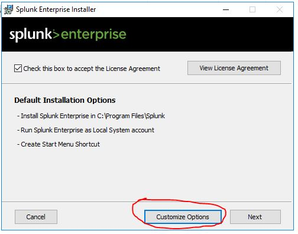
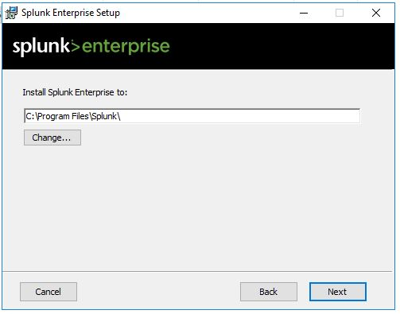
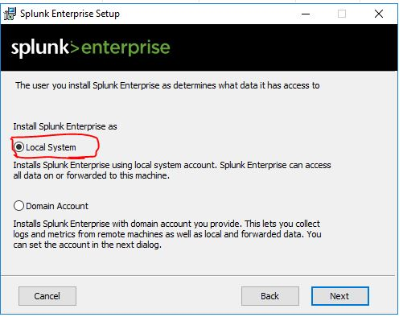
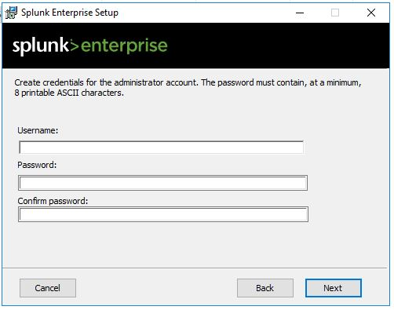

# Splunk-enterprise-trial-version-configuration-for-cyber-security-use-case-testing-and-building

* Download the Splunk Enterprise installation file from https://www.splunk.com/en_us/download.html

* Install the downloaded Splunk Enterpris file, check the box to accept the license and click on customization button

* If you want to change the installation path change it or click next

* Select local system radio button and click next

* Create administrator account for Splunk Enterprise login and click next 

